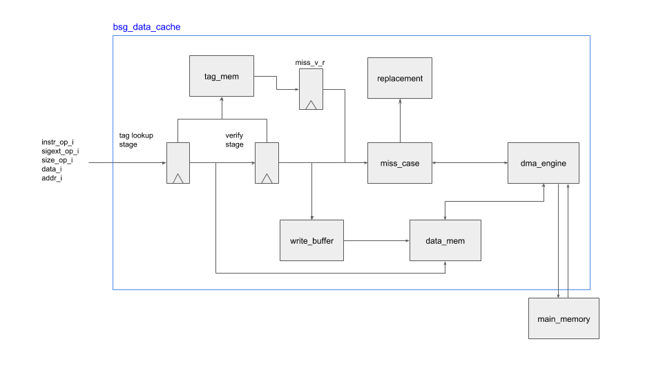
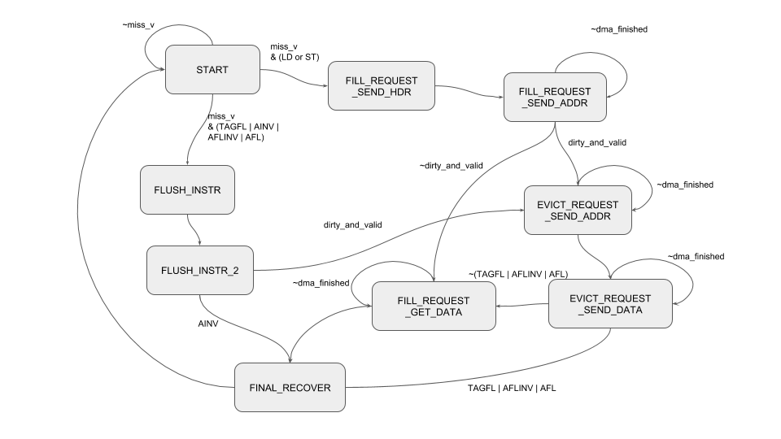

#   bsg_data_cache.v

## parameters
- block_size_p : number of words in a block.
- els_p : number of sets in cache.

## description
- instruction op.
  - 4'b0000 = LD (load)
  - 4'b0001 = ST (store)
  - 4'b0010 = TAGST (tag store)
  - 4'b0011 = TAGFL (tag flush)
  - 4'b0100 = TAGLV (tag load valid)
  - 4'b0101 = TAGLA (tag load address)
  - 4'b0110 = AFL (address flush)
  - 4'b0111 = AFLINV (address flush invalidate)
  - 4'b1000 = AINV (address invalidate)
- size_op : size of memory to be read/written.
  - 2'b00 = byte
  - 2'b01 = half (16-bits)
  - 2'b10 = word (32-bits)
  - 2'b11 = double (reserved for 64-bits)
- sigext_op
  - 0 = no sign extension
  - 1 = sign extend
- Two-way set associative.
- It handles one miss at a time. Pipeline is stalled while miss is being handled.
- There are two pipeline stages: tag-lookup (tl) and verify (v)
- LD (load) : this operation accesses both tag_mem and data_mem in the tag-lookup stage. If there was a miss, then miss_case handles the miss in verify stage.
- ST (store) : this operation looks up tags in the tag-lookup stage, and if there is a match when write data is queued in write_buffer along with write mask and write addr. If there was a miss, then miss_case handles the miss in verify stage, and write data is queued in write_buffer. The contents in write_buffer are written to data_mem, whenever data_mem is free to be written. All memories in data cache (e.g. tag_mem, data_mem, status_mem) are implemented using single-ported synchronous read SRAM (e.g. bsg_mem_1rw_sync). 
- TAGLA (tag load address)  : TAGLA accesses address content of tag_mem in TL stage, however, the previous instruction in V stage could have changed the content of tag_mem. If there was a miss with the previous instruction that could have modified tag_mem, then TAGLA in TL stage looks up tag_mem again, when miss_case is in RECOVER stage.
- TAGLV (tag load valid) : TAGLV is similar to TAGLA except that it only returns valid bit in tag_mem.
- TAGFL (tag flush) : If the chosen block is valid and dirty, then the block is flushed in verify stage by miss_case. TAGFL does not invalidate the block. However, it sets dirty bit to zero, and the target set becomes the LRU.
- TAGST (tag store) : TAGST modifies tag_mem in the tag-lookup stage. If there is a miss being handled in verify stage, data cache deasserts ready_o, if the incoming instr_op_i is TAGST. Only after the miss has been handled, and the content of tag_mem is finalized, then data cache will accept TAGST operation.
- AFL (address flush) : AFL flushes the chosen block if the target block is valid and dirty. It does not invalidate the block. AFL is different from TAGFL that TAGFL directly addresses tag_mem, whereas AFL compares both index and tags.
- AFLINV (address flush invalidate) : AFLINV flushes and invalidate valid and dirty block.
- AINV (address invalidate) : AINV invalidates the block, but does not flush even if the block was valid and dirty.

#   bsg_miss_case.v

##  miss_case states
- START
- FLUSH_INSTR
- FLUSH_INSTR_2
- FILL_REQUEST_SEND_HDR
- FILL_REQUEST_SEND_ADDR
- EVICT_REQUEST_SEND_ADDR
- EVICT_REQUEST_SEND_DATA
- FILL_REQUEST_GET_DATA
- FINAL_RECOVER

#   bsg_dma_engine.v
bsg_dma_engine receives various DMA requests from bsg_miss_case, and let it know that DMA request has been finished by dma_finished signal. bsg_dma_engine is interfaced with DMA interface with main memory, which consists of three independent channels.

- DMA Request Channel
  - dma_rd_wr_o : 0 = read, 1 = write
  - dma_addr_o : DMA request address
  - dma_req_v_o : DMA request valid
  - dma_req_yumi_i : DMA request yumi
- DMA Read Channel
  - dma_rdata_i : DMA read data
  - dma_rvalid_i : DMA read data valid
  - dma_rready_o : DMA read data ready
- DMA Write Channel
  - dma_wdata_o : DMA write data
  - dma_wvalid_o : DMA write data valid
  - dma_wready_i : DMA write data ready

# bsg_replacement.v
- it contains status_mem which has 3-bits for each index.
- {dirty0, dirty1, MRU (most recently used)}

# bsg_write_buffer.v
- bsg_write_buffer can write to data_mem only when there is no miss being handled and incoming instruction is not LD.
- bsg_miss_case cannot proceed with sending evict data or receiving refill data, unless bsg_write_buffer has been emptied out.